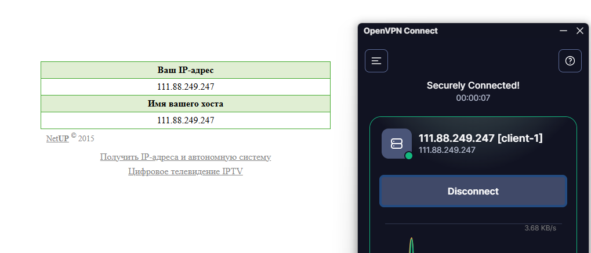
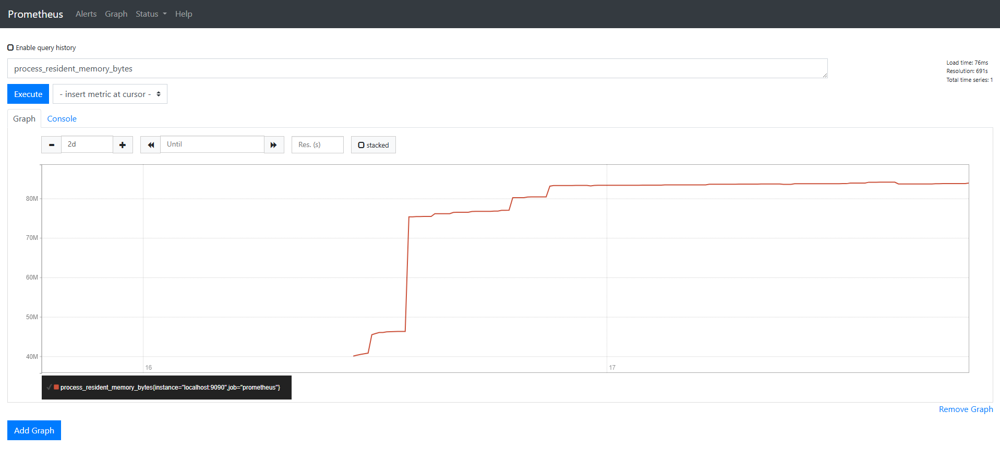
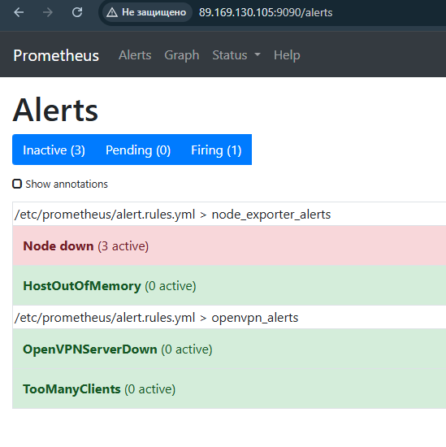
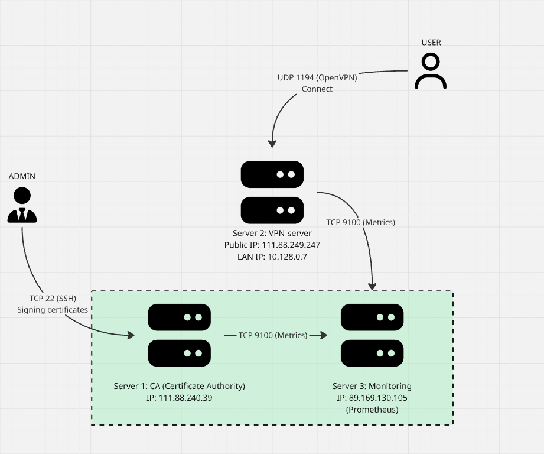

# Корпоративная VPN-инфраструктура удаленного доступа

Проект развертывания защищенной сети для удаленной работы сотрудников UI/UX компании в рамках финальной DevOps-работы.

## 📝 Описание проекта
В рамках данного кейса реализуется построение защищенной корпоративной сети для компании, занимающейся UI/UX-дизайном. Основная цель — обеспечить безопасную работу удаленных сотрудников через VPN, исключив риски при использовании публичных Wi-Fi сетей.

---

## 🔑 Этап 1: Развертывание Удостоверяющего Центра (CA)
На данном этапе реализована автоматизация настройки инфраструктуры открытых ключей (PKI) и выпуск корневого сертификата.

### 🛠 Технологический стек и безопасность
* **ОС:** Ubuntu 20.04 LTS (или аналоги на базе Debian).
* **Безопасность:** Firewalld (открыт строго порт 22/tcp для административного управления).
* **PKI:** Easy-RSA (автоматизированное управление ключами и сертификатами).

### 📦 Исходный код и автоматизация
* `setup_pki.sh` — Bash-скрипт для автоматической настройки Firewall и инициализации Root CA в режиме `batch` (без запроса паролей).
* `src/ca-server/` — каталог с исходными файлами deb-пакета (включая служебный манифест `DEBIAN/control`), который описывает необходимые зависимости (`easy-rsa`, `firewalld`).
* `setup_server.deb` — скомпилированный пользовательский deb-пакет для быстрой доставки скрипта на серверы.

### 💎 Артефакты блока
* `/root/easy-rsa/pki/ca.crt` — Корневой сертификат удостоверяющего центра.

---

## 🌐 Этап 2: Развертывание и настройка VPN-сервера
На данном этапе реализовано развертывание шлюза удаленного доступа на базе **OpenVPN Server**. Сервер интегрирован с Удостоверяющим Центром (CA), созданным на первом этапе.

### 🛠 Технологический стек шлюза
* **Сервис:** OpenVPN (туннелирование трафика).
* **Сетевой протокол:** TCP (порт 1194).
* **Шифрование:** Алгоритм Диффи-Хеллмана (`dh.pem`) + дополнительная защита от DoS-атак (`ta.key`).
* **Firewall:** Открыты порты 22/tcp (SSH) и 1194/tcp (OpenVPN).

### 📦 Исходный код и автоматизация
* `setup-vpn-server.sh` — автоматический скрипт первичной подготовки окружения, настройки Firewall шлюза и генерации запроса на сертификат сервера.
* `src/vpn-server/` — каталог с исходными файлами deb-пакета, включая конфигурацию `server.conf`, набор сертификатов и триггер автоматизации `DEBIAN/postinst`.
* `vpn-server.deb` — готовый deb-пакет для автоматического развертывания шлюза.

### 🗺 Схема взаимодействия компонентов
1. **Администратор** запускает установку `vpn-server.deb`.
2. **Пакетный менеджер** автоматически разворачивает необходимые файлы в `/etc/openvpn/server/`.
3. **Скрипт `postinst`** подтягивает локальный секретный ключ сервера и запускает службу `openvpn-server@server`.
4. **OpenVPN Server** открывает порт `1194/tcp`, изолирует трафик и поднимает внутреннюю виртуальную подсеть `10.8.0.0/24` для безопасного подключения удаленных сотрудников.

### 💎 Артефакты блока
* Статус службы `openvpn-server@server`: **`active (running)`** (Initialization Sequence Completed).
* **Клиент успешно подключен к впн серверу:**
  

---

### 📊 Этап 3: Централизованный мониторинг и оповещения (Prometheus)
На данном этапе реализована централизованная система мониторинга всей ИТ-инфраструктуры компании и настроены триггеры для оперативного реагирования на сбои.

#### 🛠 Технологический стек и безопасность
* **Сервер мониторинга**: Prometheus (сбор метрик) + Alertmanager (маршрутизация алертов).
* **Сбор системных метрик**: Node Exporter (процессор, оперативная память, диски).
* **Сбор метрик VPN**: OpenVPN Exporter (контроль подключений сотрудников и трафика).
* **Файрвол**: Правила `iptables` на целевых серверах закрывают порты экспортеров (`9100`, `9176`) для всего внешнего трафика, разрешая входящие запросы исключительно с IP-адреса сервера Prometheus (`10.128.0.35`).

#### 📜 Исходный код и автоматизация
* `src/monitoring-server/` — каталог с исходными файлами deb-пакета, включая конфигурацию `prometheus.yml` со списком целей и файл `alert.rules.yml` с описанием пороговых триггеров.
* `monitoring-server/DEBIAN/postinst` — автоматический скрипт настройки, который подменяет дефолтный конфиг и перезапускает службы мониторинга.
* `monitoring-server.deb` — готовый deb-пакет для автоматического развертывания независимого сервера мониторинга на третьей машине.
* Интеграция в существующие пакеты: сборщики метрик зашиты в зависимости и скрипты `postinst` пакетов `setup-server.deb` (для CA) и `vpn-server.deb` (для VPN-сервера с ручной компиляцией OpenVPN Exporter на Go).

#### 📋 Схема взаимодействия компонентов
1. Администратор разворачивает `monitoring-server.deb` на выделенной машине.
2. При установке пакетов `setup-server.deb` и `vpn-server.deb` на целевых хостах автоматически поднимаются изолированные агенты-экспортеры.
3. Prometheus по pull-модели опрашивает агентов каждые 15 секунд.
4. При падении любого сервиса или превышении лимитов по ресурсам (CPU, RAM, Over-connections) срабатывают правила фильтрации и Alertmanager формирует оповещение.

#### 💎 Артефакты блока
* **Исторические данные метрик за несколько дней (Диапазон 2d):**


* **Активные и настроенные алерты в веб-интерфейсе:**


---

## 💾 Этап 4: Резервное копирование и обеспечение отказоустойчивости

Реализована комплексная система защиты инфраструктуры от критических сбоев, потери конфигураций и человеческого фактора.

### 📐 Архитектура и автоматизация хранения
Резервное копирование настроено изолированно на каждом сервере для исключения единой точки отказа:
* **Машина №1 (Удостоверяющий Центр):** Скрипт `src/backup/backup_ca.sh` каждую ночь архивирует всю корневую базу PKI и закрытый ключ CA (`/home/yc-user/easy-rsa`), гарантируя возможность восстановления контроля над выпуском сертификатов.
* **Машина №2 (VPN-шлюз):** Скрипт `src/backup/backup_vpn.sh` архивирует системные настройки OpenVPN (`/etc/openvpn`) и ключи сотрудников (`~/clients/keys`).

### 🔄 Безопасная ротация и хранение данных
* **Автоматизация:** Оба скрипта интегрированы в планировщик `cron` и запускаются ежесуточно в 03:00 ночи. Архивы сохраняются в изолированные локальные директории (`/var/backups/`).
* **Безопасность данных:** Реализована безопасная ротация по маске имени (`find -name "*.tar.gz" -mtime +14`). Скрипты автоматически удаляют **только старые файлы архивов бэкапов** старше 14 дней. **Оригинальные рабочие ключи сотрудников и конфигурации в живой системе никогда не затрагиваются и не удаляются**, что гарантирует непрерывность доступа дизайнеров к сети.

### 🚨 Мониторинг и алертинг компонента
* Для сквозного контроля бэкапов внедрен механизм "флага успеха" (`backup_success.flag`).
* В конфигурацию Prometheus добавлен специализированный PromQL-алерт **`BackupAgeTooOld`**. Если файл-флаг не обновлялся планировщиком более 26 часов, система автоматически генерирует критическое оповещение для дежурного инженера.

### 📄 Документация и сценарии восстановления
* Подробный архитектурный runbook, включающий **5 детальных сценариев отказа** (Disaster Recovery) и планы аварийного восстановления, оформлен в виде отдельного документа:
➡️ **[Перейти к файлу документации BACKUP.md](BACKUP.md)**

## Документация 
# Документация по инфраструктуре защищённой сети и мониторинга

Репозиторий содержит полный пакет артефактов для развернутой инфраструктуры проекта.

---

## 1. Схема инфраструктуры и потоков данных (Data Flow)
Схема архитектуры сети, серверов и направлений трафика:



### Описание информационных потоков:
* **Администрирование:** Администратор (ADMIN) подключается к Серверу 1 (CA) по протоколу `SSH (TCP порт 22)` для управления сертификатами.
* **Доступ пользователей:** Пользователь (USER) подключается к Серверу 2 (VPN) снаружи через протокол `OpenVPN (UDP порт 1194)`. После этого трафик идет во внутренний контур.
* **Мониторинг (Pull-модель):** Сервер 3 (Monitoring) опрашивает Сервер 1 (CA) и Сервер 2 (VPN) по внутреннему контуру через протокол `HTTP (TCP порт 9100)` службы Node Exporter для сбора метрик.

---

## 2. Руководство пользователя VPN

### Зачем это нужно?
VPN (Virtual Private Network) обеспечивает безопасный зашифрованный доступ к внутренним ресурсам компании, серверам разработки и базам данных из любой точки мира. Он защищает ваш трафик от перехвата в публичных сетях.

### Пошаговый алгоритм подключения:

1. **Получение конфигурационного файла:**
   Обратитесь к вашему системному администратору. Он сгенерирует для вас персональный файл с расширением `.ovpn` (например, `user_vanya.ovpn`). 
   *Важно: не передавайте этот файл третьим лицам!*

2. **Установка клиента под вашу ОС:**
   * **Windows / macOS:** Скачайте официальный клиент [OpenVPN Connect](https://openvpn.net).
   * **Android / iOS:** Найдите и установите приложение **OpenVPN Connect** через Google Play или App Store.
   * **Linux (Ubuntu/Debian):** Выполните в консоли: `sudo apt update && sudo apt install openvpn`.

3. **Настройка клиента:**
   * Импортируйте файл `.ovpn` в приложение OpenVPN Connect (просто перетащите его мышкой в окно программы).
   * Нажмите кнопку **Connect** (тумблер должен загореться зелёным цветом).

### Техническая поддержка и недочёты
Если у вас возникли проблемы с подключением (не импортируется профиль, ошибка авторизации, не работают внутренние ресурсы):
* Направьте обращение на почту технической поддержки: **support@project.ru**
* К письму обязательно прикрепите: ваше имя, текст/скриншот ошибки и файл логов из приложения.

---

## 3. Руководство системного администратора

### 3.1. Общее описание системы
* **Облачный провайдер:** Yandex Cloud.
* **Расположение:** Облако развернуто в каталоге `default`, регион `ru-central1-a`.
* **Название проекта:** `remote-office-infrastructure`.
* **Доступы к аккаунтам:** Доступ к консоли Yandex Cloud имеют аккаунты группы `DevOps-Lead` и владелец организации `admin@project.ru`. Доступ к ОС серверов осуществляется строго по SSH-ключам.

### 3.2. Список доменных имён и полезных ссылок
* **Внешний шлюз VPN:** `(IP: `111.88.249.247`)
* **Интерфейс Prometheus:** `http://89.169.130.105:9090` (Доступ внутри VPN)
* **Интерфейс Alertmanager:** `http://89.169.130.105:9093` (Доступ внутри VPN)
* **Репозиторий со скриптами автоматизации:** `https://github.com/Vlatricks/remote-office-infrastructure`

### 3.3. Существующие компоненты и их взаимодействие
Система состоит из трёх серверов на базе Ubuntu 22.04 LTS:
1. **Сервер 1: CA (Центр сертификации)**. Выпускает ключи. Изолирован от прямого доступа из интернета.
2. **Сервер 2: VPN (Gateway)**. Точка входа для внешних клиентов, шлюзует трафик во внутреннюю подсеть `10.128.0.0/24`.
3. **Сервер 3: Monitoring**. Содержит стек Prometheus для сбора метрик и Alertmanager для отправки уведомлений.

### 3.4. Пошаговая настройка серверов

Все необходимые bash-скрипты автоматизации и кастомные deb-пакеты конфигураций берутся из нашего внутреннего репозитория: `https://github.com/Vlatricks/remote-office-infrastructure/src`.

#### Шаг 1: Создание виртуальных машин в Yandex Cloud (CLI)
Создание серверов выполняется командами через `yc compute instance`:
```bash
# Создание VPN сервера с публичным IP
yc compute instance create \
 --name VPN-server \
 --zone ru-central1-a \
 --network-interface subnet-name=default-ru-central1-a,nat-ip-version=ipv4 \
 --create-boot-disk image-folder-id=standard-images,image-family=ubuntu-2004-lts \
 --ssh-key ~/.ssh/id_ed25519.pub

# Создание серверов CA и Monitoring без публичного IP (только LAN)
yc compute instance create --name ca-server --zone ru-central1-a --network-interface subnet-name=default-ru-central1-a --create-boot-disk image-family=ubuntu-2204-lts,size=15 --ssh-key ~/.ssh/id_rsa.pub
yc compute instance create --name monitoring-server --zone ru-central1-a --network-interface subnet-name=default-ru-central1-a --create-boot-disk image-family=ubuntu-2204-lts,size=20 --ssh-key ~/.ssh/id_rsa.pub
```

#### Шаг 2: Конфигурирование ОС и запуск сервисов
1. **На сервере CA:** Смотреть этап 1.
2. **На сервере VPN:** Смотреть этап 2.
3. **На сервере Monitoring:** Смотреть этап 3.

#### Шаг 3: Проверка работоспособности
* Проверка доступности VPN-службы: проверка статуса `systemctl status openvpn@server`.
* Проверка сбора метрик: зайти в веб-интерфейс Prometheus во вкладку `Status -> Targets` и убедиться, что все хосты имеют статус `UP`.

### 3.5. Система резервного копирования
Смотреть этап 4

### 3.6. Система мониторинга и описание алертов
Prometheus собирает метрики каждые 15 секунд. Настроены следующие алерты:

1. **Алерт: `Node down`**
   * *Что означает:* Пропал сигнал от Node Exporter на одном из серверов (сервер выключен, завис или проблемы с сетью).
   * *Что делать:* Зайти в панель Yandex Cloud, проверить статус VM. Если машина активна, зайти по SSH и проверить службу: `sudo systemctl status node_exporter`.
2. **Алерт: `HostOutOfMemory`**
   * *Что означает:* На сервере заканчивается оперативная память (доступно менее 10% от общего объема).
   * *Что делать:* Подключиться к серверу, выполнить команду `top` или `htop`, выявить процесс-нарушитель. При необходимости перезапустить проблемную  службу.
3. **Алерт: `TooManyClients`**
   * *Что означает:* Подключеных пользователей к VPN превысило 30 человек.
   * *Что делать:* Проверить текущую нагрузку на сеть и процессор VPN-сервера (`htop`, `iftop`). Высокое число клиентов может быть вызвано началом рабочего дня, но если оно аномально растёт, необходимо проверить логи подключений на предмет брутфорса или несанкционированного доступа. При стабильном росте штата сотрудников потребуется изменить лимиты в конфигурации OpenVPN и, возможно, масштабировать ресурсы виртуальной машины.

