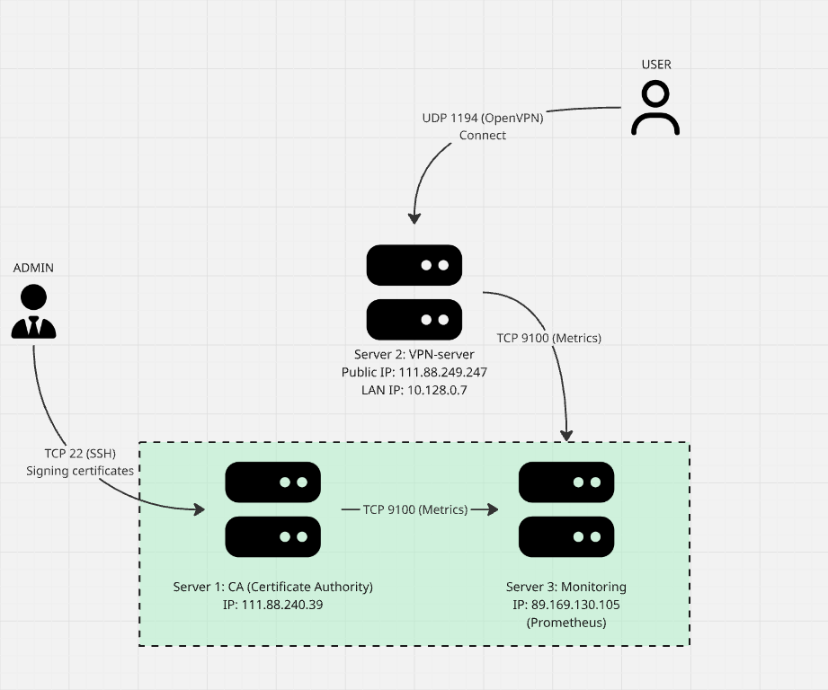
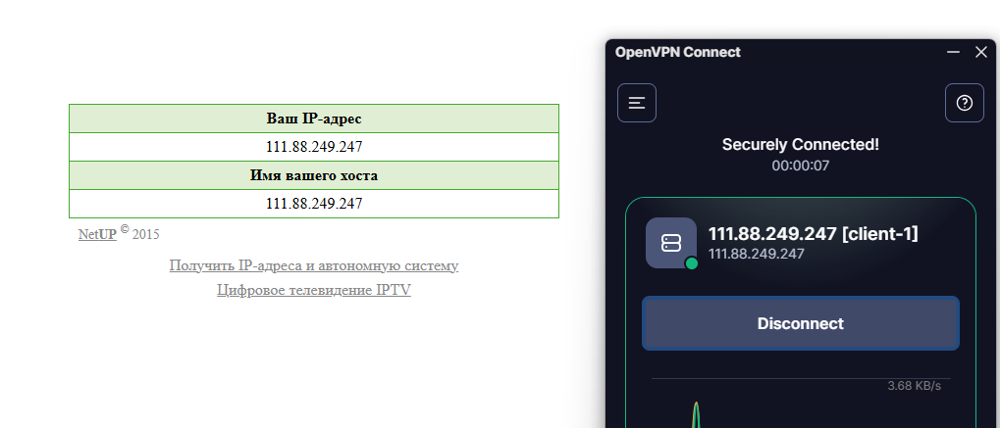
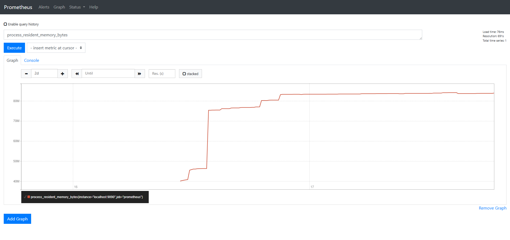
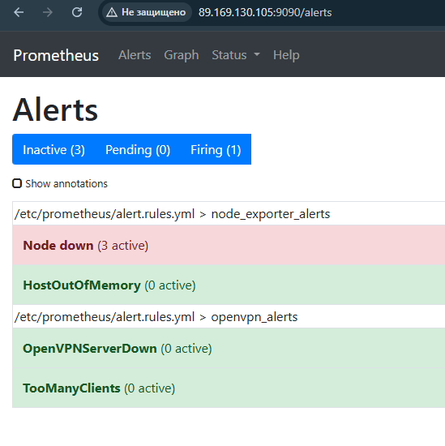

# Корпоративная VPN-инфраструктура удалённого доступа

Защищённая сеть для удалённой работы сотрудников UI/UX-компании: OpenVPN-шлюз, собственный Удостоверяющий Центр (PKI), централизованный мониторинг и резервное копирование. Финальная работа курса по системному администрированию / DevOps.

**Цель:** безопасная работа сотрудников из любых сетей, включая публичный Wi-Fi, без риска перехвата трафика.

## Содержание

- [Архитектура](#архитектура)
- [Структура репозитория](#структура-репозитория)
- [Быстрый старт](#быстрый-старт)
- [Этап 1. Удостоверяющий центр](#этап-1-удостоверяющий-центр-ca)
- [Этап 2. VPN-сервер](#этап-2-vpn-сервер)
- [Этап 3. Мониторинг и алерты](#этап-3-мониторинг-и-алерты)
- [Этап 4. Резервное копирование](#этап-4-резервное-копирование)
- [Руководство пользователя VPN](#руководство-пользователя-vpn)
- [Руководство администратора](#руководство-администратора)
- [Roadmap](#roadmap)

## Архитектура

| Сервер | Роль | Доступ извне | Порты |
|---|---|---|---|
| Сервер 1: `ca-server` | Удостоверяющий центр (Easy-RSA) | Нет (только внутренняя сеть) | 22/tcp, 9100/tcp (только с Prometheus) |
| Сервер 2: `VPN-server` | Шлюз OpenVPN | Да, публичный IP | 22/tcp, 1194/tcp, 9100 и 9176/tcp (только с Prometheus) |
| Сервер 3: `monitoring-server` | Prometheus + Alertmanager | Нет (доступ через VPN) | 22/tcp, 9090/tcp, 9093/tcp |

Облако: Yandex Cloud, зона `ru-central1-a`, внутренняя подсеть `10.128.0.0/24`, ОС Ubuntu 22.04 LTS. VPN-клиенты получают адреса из подсети `10.8.0.0/24`.



**Потоки данных**

- **Администрирование:** администратор подключается к серверам по SSH (22/tcp).
- **Доступ пользователей:** сотрудник подключается к VPN-шлюзу по OpenVPN (порт 1194), далее трафик идёт во внутренний контур.
- **Мониторинг (pull):** Prometheus каждые 15 секунд опрашивает Node Exporter (`:9100`) на CA и VPN, а также OpenVPN Exporter (`:9176`) на VPN.

## Структура репозитория

```
.
├── README.md
├── BACKUP.md              # runbook: 5 сценариев аварийного восстановления
├── roadmap.md             # план развития
├── setup_pki.sh           # развёртывание CA
├── setup-vpn-server.sh    # подготовка VPN-шлюза и запрос сертификата
├── setup-server.deb       # пакет CA
├── vpn-server.deb         # пакет VPN-шлюза
├── monitoring-server.deb  # пакет сервера мониторинга
├── screenshots/           # скриншоты и схема
└── src/
    ├── ca-server/         # исходники deb-пакета CA
    ├── vpn-server/        # исходники deb-пакета VPN (server.conf, postinst)
    ├── monitoring-server/ # prometheus.yml, alert.rules.yml, postinst
    └── backup/            # backup_ca.sh, backup_vpn.sh
```

## Быстрый старт

Порядок развёртывания важен: CA → VPN → мониторинг.

```bash
# 1. CA-сервер
sudo dpkg -i setup-server.deb          # или: sudo ./setup_pki.sh

# 2. VPN-сервер
sudo ./setup-vpn-server.sh             # создаёт запрос vpn-server.req
# передать запрос на CA, подписать, вернуть сертификат (см. этап 2)
sudo dpkg -i vpn-server.deb

# 3. Сервер мониторинга
sudo dpkg -i monitoring-server.deb
```

Если `dpkg` ругается на зависимости: `sudo apt -f install`.

### Создание виртуальных машин (Yandex Cloud CLI)

```bash
# VPN-сервер с публичным IP
yc compute instance create \
  --name VPN-server \
  --zone ru-central1-a \
  --network-interface subnet-name=default-ru-central1-a,nat-ip-version=ipv4 \
  --create-boot-disk image-family=ubuntu-2204-lts,image-folder-id=standard-images \
  --ssh-key ~/.ssh/id_ed25519.pub

# CA и Monitoring без публичного IP
yc compute instance create --name ca-server --zone ru-central1-a \
  --network-interface subnet-name=default-ru-central1-a \
  --create-boot-disk image-family=ubuntu-2204-lts,size=15 \
  --ssh-key ~/.ssh/id_ed25519.pub

yc compute instance create --name monitoring-server --zone ru-central1-a \
  --network-interface subnet-name=default-ru-central1-a \
  --create-boot-disk image-family=ubuntu-2204-lts,size=20 \
  --ssh-key ~/.ssh/id_ed25519.pub
```

## Этап 1. Удостоверяющий центр (CA)

Автоматизация PKI и выпуск корневого сертификата.

- **ОС:** Ubuntu 22.04 LTS
- **PKI:** Easy-RSA
- **Firewall:** firewalld, открыт только 22/tcp

**Файлы**

- `setup_pki.sh`: ставит firewalld и easy-rsa, настраивает firewall, инициализирует PKI и создаёт Root CA в режиме `batch` без пароля.
- `src/ca-server/`: исходники deb-пакета (`DEBIAN/control` с зависимостями `easy-rsa`, `firewalld`).
- `setup-server.deb`: готовый пакет.

**Артефакт:** `~/easy-rsa/pki/ca.crt` (корневой сертификат).

> ⚠️ Root CA создаётся с `nopass`. Для учебного стенда это приемлемо, для продакшена задайте пароль на ключ CA.

## Этап 2. VPN-сервер

Шлюз на **OpenVPN**, интегрированный с CA из этапа 1.

- **Протокол:** TCP, порт 1194
- **Защита:** параметры Диффи-Хеллмана (`dh.pem`) и `tls-auth` (`ta.key`) против DoS
- **Firewall:** 22/tcp и 1194/tcp
- **Подсеть клиентов:** `10.8.0.0/24`

**Файлы**

- `setup-vpn-server.sh`: подготовка окружения, firewall, генерация запроса сертификата `vpn-server.req`.
- `src/vpn-server/`: исходники deb-пакета (`server.conf`, `DEBIAN/postinst`).
- `vpn-server.deb`: готовый пакет.

**Как это работает**

1. Администратор запускает `setup-vpn-server.sh` и получает `vpn-server.req`.
2. Запрос копируется на CA и подписывается (`./easyrsa sign-req server vpn-server`).
3. Подписанный сертификат и `ca.crt` возвращаются на VPN-сервер.
4. Устанавливается `vpn-server.deb`: файлы попадают в `/etc/openvpn/server/`, `postinst` подключает секретный ключ и запускает `openvpn-server@server`.

**Артефакты:** служба `openvpn-server@server` в состоянии `active (running)`, клиент подключён:



## Этап 3. Мониторинг и алерты

- **Prometheus** собирает метрики, **Alertmanager** маршрутизирует оповещения.
- **Node Exporter** (`:9100`): CPU, RAM, диски.
- **OpenVPN Exporter** (`:9176`): подключения и трафик клиентов.
- **Firewall (iptables):** порты экспортеров закрыты для всех, кроме IP Prometheus (`10.128.0.35`).

**Файлы**

- `src/monitoring-server/prometheus.yml`: список целей.
- `src/monitoring-server/alert.rules.yml`: правила алертов.
- `src/monitoring-server/DEBIAN/postinst`: подменяет конфиг и перезапускает службы.
- `monitoring-server.deb`: готовый пакет.

Экспортеры устанавливаются автоматически вместе с `setup-server.deb` и `vpn-server.deb` (OpenVPN Exporter собирается из исходников на Go).

### Алерты

| Алерт | Условие | Что делать |
|---|---|---|
| `Node down` | Нет ответа от Node Exporter | Проверить VM в консоли Yandex Cloud; если жива, на сервере `sudo systemctl status node_exporter` |
| `HostOutOfMemory` | Свободно менее 10% RAM | `top`/`htop`, найти процесс-нарушитель, при необходимости перезапустить службу |
| `TooManyClients` | Более 30 VPN-клиентов | `htop`/`iftop`, проверить логи на брутфорс; при росте штата увеличить лимиты в `server.conf` и ресурсы VM |
| `BackupAgeTooOld` | `backup_success.flag` не обновлялся более 26 часов | Проверить `cron` и лог скрипта бэкапа (см. [BACKUP.md](BACKUP.md)) |

**Артефакты**




## Этап 4. Резервное копирование

Бэкап настроен независимо на каждом сервере, чтобы не создавать единую точку отказа.

| Сервер | Скрипт | Что архивируется |
|---|---|---|
| CA | `src/backup/backup_ca.sh` | PKI и закрытый ключ CA (`~/easy-rsa`) |
| VPN | `src/backup/backup_vpn.sh` | `/etc/openvpn` и ключи клиентов (`~/clients/keys`) |

- **Расписание:** `cron`, ежедневно в 03:00.
- **Хранение:** `/var/backups/`, ротация по маске `*.tar.gz` старше 14 дней (рабочие ключи и конфиги не затрагиваются).
- **Контроль:** после успешного бэкапа обновляется `backup_success.flag`; алерт `BackupAgeTooOld` сработает, если флаг старше 26 часов.

Сценарии аварийного восстановления: **[BACKUP.md](BACKUP.md)**.

## Руководство пользователя VPN

VPN шифрует ваш трафик и даёт доступ к внутренним ресурсам компании из любой точки.

1. **Получите профиль.** Администратор выдаст персональный файл `.ovpn` (например, `user_vanya.ovpn`). Не передавайте его третьим лицам.
2. **Установите клиент:**
   - Windows / macOS: [OpenVPN Connect](https://openvpn.net/client/)
   - Android / iOS: OpenVPN Connect из Google Play / App Store
   - Linux: `sudo apt update && sudo apt install openvpn`
3. **Подключитесь.** Импортируйте `.ovpn` в OpenVPN Connect и нажмите **Connect**. На Linux: `sudo openvpn --config user_vanya.ovpn`.

**Проблемы с подключением?** Напишите на `support@project.ru` и приложите имя, текст или скриншот ошибки и лог из приложения.

## Руководство администратора

### Общие сведения

- **Провайдер:** Yandex Cloud, каталог `default`, зона `ru-central1-a`, проект `remote-office-infrastructure`.
- **Доступ:** к консоли облака имеют аккаунты группы `DevOps-Lead` и владелец организации; к ОС серверов только по SSH-ключам.
- **Внешний шлюз VPN:** `<PUBLIC_IP_VPN>`
- **Prometheus:** `http://<MONITORING_IP>:9090` (только изнутри VPN)
- **Alertmanager:** `http://<MONITORING_IP>:9093` (только изнутри VPN)

### Проверка работоспособности

- VPN: `sudo systemctl status openvpn-server@server`
- Метрики: Prometheus → *Status → Targets*, все цели в статусе `UP`.

### Выпуск VPN-профиля

Выполняется на **сервере CA**.

```bash
cd ~/easy-rsa
./easyrsa gen-req user_vanya nopass      # ключ и запрос
./easyrsa sign-req client user_vanya     # подписать (yes + пароль CA, если задан)
sudo ~/clients/make_config.sh user_vanya # собрать ~/clients/user_vanya.ovpn
```

Передайте `.ovpn` сотруднику по защищённому каналу (корпоративный мессенджер, шифрованная почта). Вместо `user_vanya` укажите логин сотрудника.

### Отзыв сертификата (увольнение сотрудника)

```bash
# На CA
cd ~/easy-rsa
./easyrsa revoke user_vanya              # подтвердить: yes
./easyrsa gen-crl

# Скопировать список отзыва на VPN-сервер
scp pki/crl.pem <user>@10.128.0.7:/etc/openvpn/

# На VPN-сервере (если OpenVPN не подхватил CRL сам)
sudo systemctl restart openvpn-server@server
```

> ⚠️ В `server.conf` должна быть директива `crl-verify /etc/openvpn/crl.pem`, иначе отзыв не будет действовать.

## Roadmap

План развития инфраструктуры: **[roadmap.md](roadmap.md)**.
